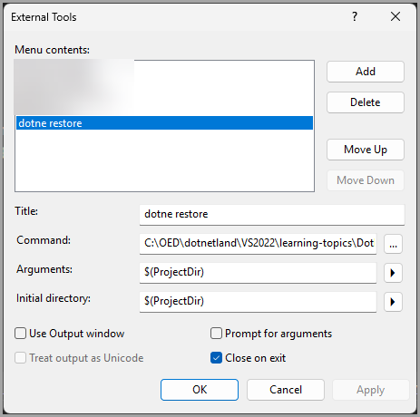

# About
DotNetRestoreRunner is a simple tool to automate the process of running `dotnet restore` on a specified solution or project directory. It provides a clear and colorful console output using Spectre.Console to indicate the progress and results of the restore operation.

## External Tool

- Setup as a Visual Studio External Tool to run `dotnet restore` directly from the IDE.

