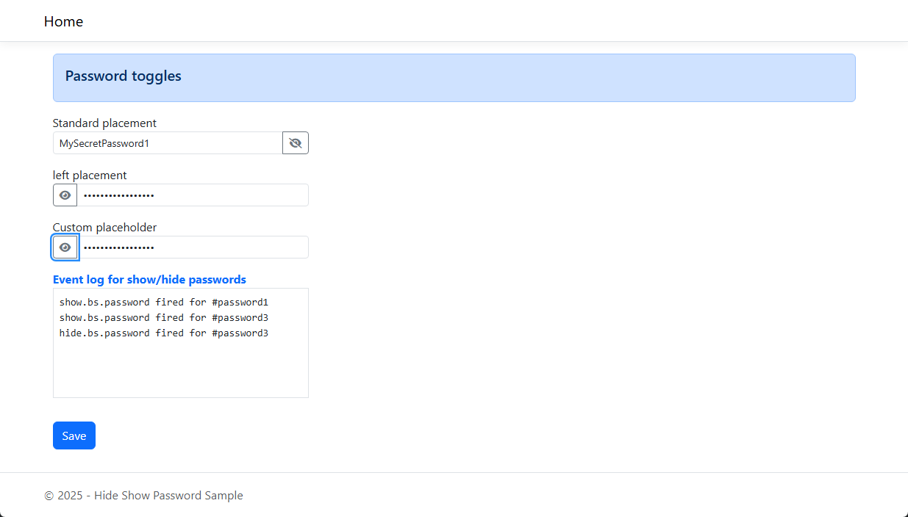

# Bootstrap Show Password

Sample for providing an eye icon to show/hide password input.

Plugin [homepage](https://bootstrap-show-password.wenzhixin.net.cn/home/)

In this sample the CDN was used in _layouts/head.html_.

```html
<script src="https://unpkg.com/bootstrap-show-password@1.3.0/dist/bootstrap-show-password.min.js"></script>
```

Recommend downloading source [here](https://bootstrap-show-password.wenzhixin.net.cn/getting-started/).

