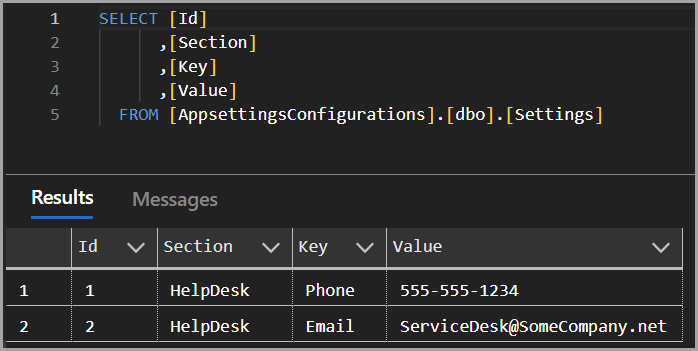

# About

This project demonstrates using an [in-memory provider](https://learn.microsoft.com/en-us/aspnet/core/fundamentals/configuration/?view=aspnetcore-9.0#memory-configuration-provider) class, which allows database values, in this case, to be incorporated into [ConfigurationBuilder](https://learn.microsoft.com/en-us/dotnet/api/microsoft.extensions.configuration.configurationbuilder?view=net-9.0-pp) along with appsettings.json.

## Database

### Model

```csharp
public class HelpDesk
{
    public string? Phone { get; set; }
    public string? Email { get; set; }
}
```

### Table in SQL Server



## Program.cs

The following code sets up for obtaining the in-memory collection which reads from a database table and connection string from `appsettings.json`.

```csharp
var configurationBuilder = new ConfigurationBuilder()
    .SetBasePath(AppDomain.CurrentDomain.BaseDirectory)
    .AddJsonFile("appsettings.json", optional: false, reloadOnChange: true)
    .AddInMemoryCollection(DataOperations.GetHelpDeskValues());
```

Next, build configuration and register.

```csharp
var configuration = configurationBuilder.Build();
builder.Services.AddSingleton<IConfiguration>(configuration);
```

## Displaying the values from the in-memory collection

We will display `HelpDesk` information in the application footer.

### _ViewImports.cshtml

Add the following line to `_ViewImports.cshtml` to access the DbContext `_Layout.cshtml`.
```csharp
@inject Context _context
```

Add the following line to `_ViewImports.cshtml` to access logging in `_Layout.cshtml`.

```csharp
@inject ILogger<dynamic> Logger
```

### _Layout.cshtml

Add the following a top of page.

```csharp
@inject Context _context
@inject ILogger<dynamic> Logger
```

Replace the footer section with the following code. Note we access database values no different than accessing `appsettings.json` which wha the in-memory collection is doing.

```csharp
<footer class="border-top footer text-muted">

    <div class="container">
            
        @{
            Logger.LogInformation("Reading help desk value...");
            /*
             * Read the HelpDesk section in memory collection, see configurationBuilder in Program.cs
             */
            var helpDesk = Configuration.GetSection(nameof(HelpDesk)).Get<HelpDesk>();
            var email = helpDesk.Email;
            var phone = helpDesk.Phone;
        }

        <span class="text-success fw-bold">Help Desk:</span> <strong>Phone</strong> @phone
        <div class="vr opacity-100"></div> <strong>Email</strong> @email
            
    </div>
</footer>
```

