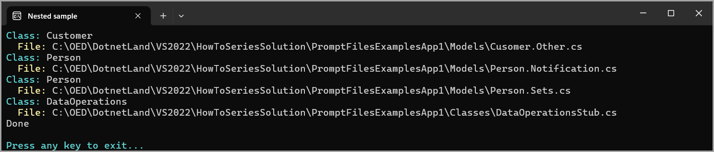

# About

This project generates a `.filenesting.json` for a partial class in another project.

The `.filenesting.json` is created in this project debug folder.




As coded the results, all partial classes in the target project are written but only one can be used which if all are needed to the article below. 

```json
{
  "help": "https://go.microsoft.com/fwlink/?linkid=866610",
  "root": true,
  "dependentFileProviders": {
    "add": {
      "fileToFile": {
        "add": {
          "Cusomer.Other.cs": [
            "Customer.cs"
          ],
          "Person.Notification.cs": [
            "Person.cs"
          ],
          "Person.Sets.cs": [
            "Person.cs"
          ],
          "DataOperationsStub.cs": [
            "DataOperations.cs"
          ]
        }
      }
    }
  }
}
```
# Usage

Change the `path` variable in the `Program.cs` file to point to the project containing the partial class.

The code will search all folders in the target project for files that match the partial classes.

## See also:

🔸[Create C# nested files in Visual Studio](https://dev.to/karenpayneoregon/create-c-nested-files-in-visual-studio-3j20)