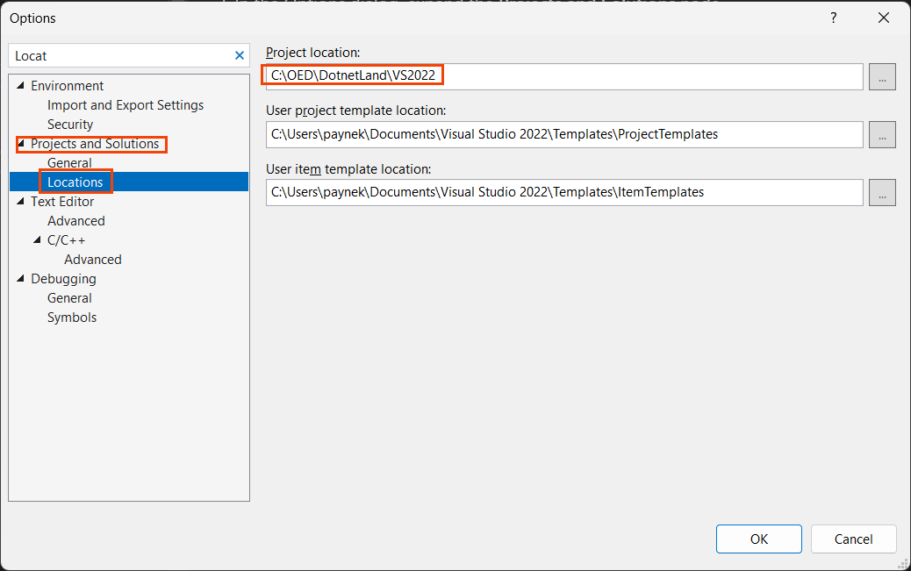
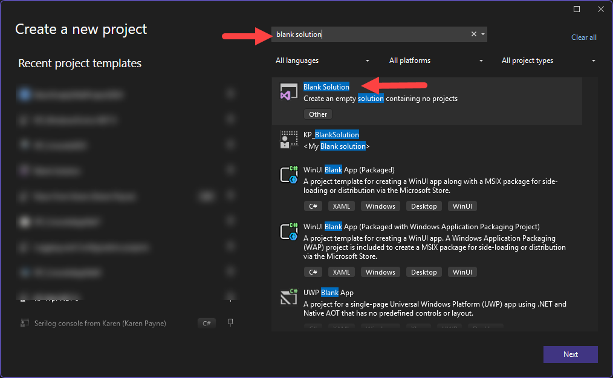
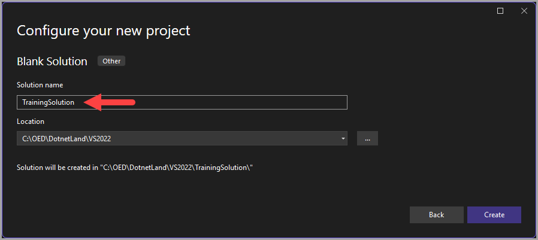
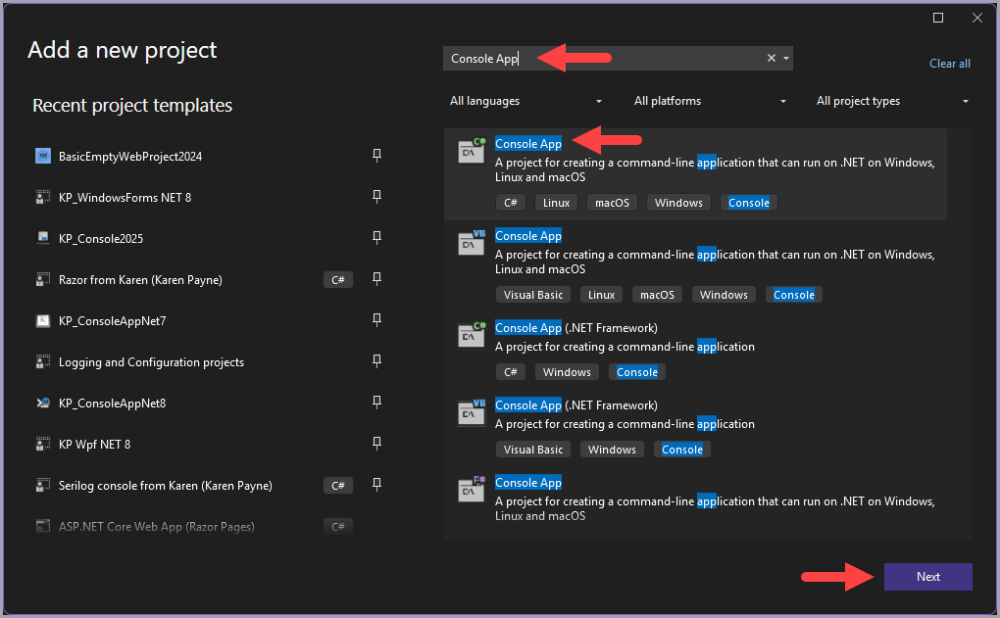
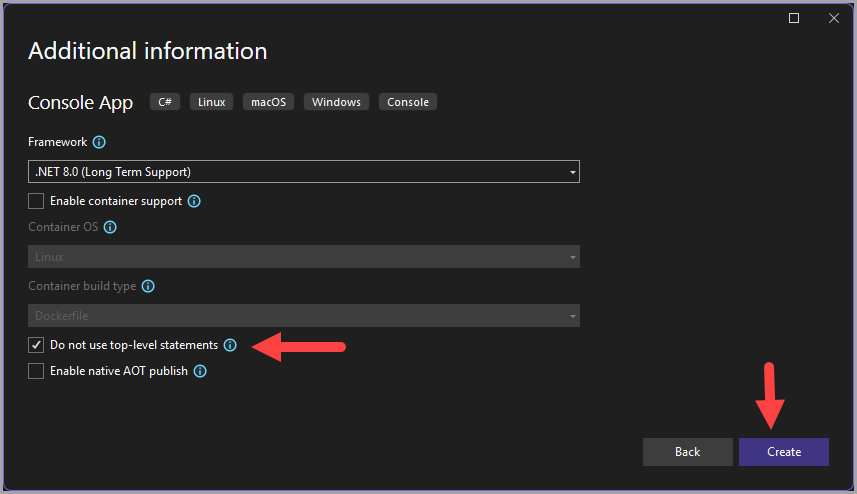
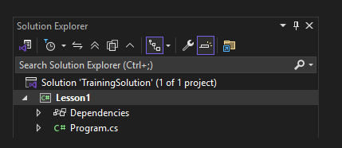
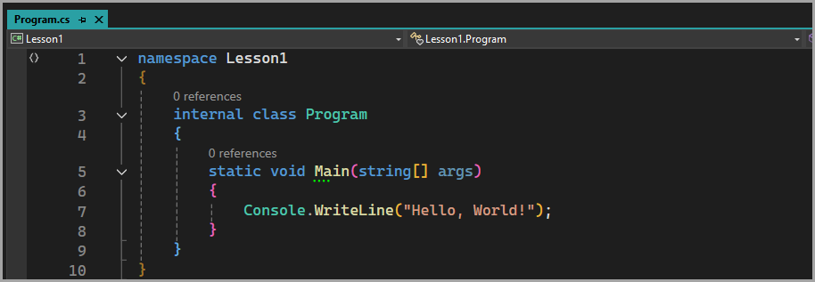
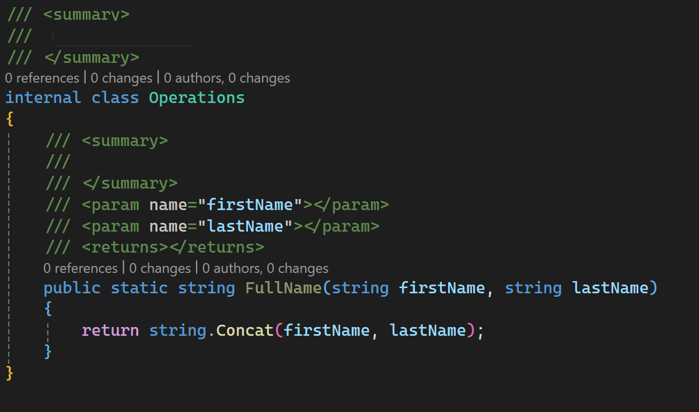

#  How to create a new solution and projects in Visual Studio

<!--TOC-->
  - [Gentax](#gentax)
  - [Set-up default project location](#set-up-default-project-location)
  - [Create a solution](#create-a-solution)
    - [To create a new solution:](#to-create-a-new-solution)
  - [Create a new project in the solution](#create-a-new-project-in-the-solution)
    - [View from Solution Explorer](#view-from-solution-explorer)
  - [Customize window layouts and personalize tabs](#customize-window-layouts-and-personalize-tabs)
  - [Dock Solution Explorer](#dock-solution-explorer)
  - [Common Keyboard shortcuts](#common-keyboard-shortcuts)
  - [Comments](#comments)
  - [Customize startup](#customize-startup)
  - [Organize and edit code in Visual Studio](#organize-and-edit-code-in-visual-studio)
<!--/TOC-->
The following instructions will walk you through creating a home for learning C#.

The instructions will create a Visual Studio solution, which is done once and becomes a central location for creating several console projects for the free camp learning.

:white_check_mark: Avoid using spaces in solution or project names, as well as in file names. 

:bulb: [What are solutions and projects in Visual Studio](https://learn.microsoft.com/en-us/visualstudio/ide/solutions-and-projects-in-visual-studio?view=visualstudio)?

## Gentax

Must disable for training.

## Set-up default project location

1. Select **Tools** > **Options** from the menu.
2. In the Options dialog, expand the **Projects and Solutions** node.
3. Select **Locations**.
4. In the **Projects location** box, enter the path where you want to store your projects.
5. Click **OK** to save your changes.

**Figure 1**

## Create a solution

A solution is a container that organizes one or more related projects in Visual Studio. 

By creating a solution all your projects are in one place, making it easier to manage and navigate between them.

For trainng this is only needed one time.

### To create a new solution:

- Select **File** > **New Project...** from the menu.
- The following dialog will appear.
   - As shown, type in blank solution in the search box.
   - Click the **Next button**.

> **Note**
> The blured text shows recently opened solutions and projects. To open one of them, simply click on it.

- In the next dialog (The location will be which was selected in figure 1 above):
   - Enter a name for your solution in the **Solution name** box, e.g., `TrainingSolution`
   - Click the **Create** button.

## Create a new project in the solution

- From Visual Studio menu, select View > Solution Explorer.
- In the Solution Explorer, right-click on the solution node (e.g., `TrainingSolution`) and select **Add** > **New Project...**.
- Type in `Console App` in the search box.
- Click the **Next button**.

- Give the project a meaningful name, e.g., `Lesson1`. Avoid spaces and special characters in the project name followed by on the next page I recommend :bulb: checking `Do not use top-level namespaces`.
- `Framework` accept the default selection.
- Click the **Create** button.

### View from Solution Explorer

Double-click on `Program.cs` to open the code editor.

## Customize window layouts and personalize tabs

In Visual Studio, you can customize the position, size, and behavior of windows to create window layouts that work best for various development workflows. You can also personalize how you use tabs to interact with your code.

For more see the following [article](https://learn.microsoft.com/en-us/visualstudio/ide/customizing-window-layouts-in-visual-studio?view=vs-2022)

## Dock Solution Explorer

:bulb: In the [video](https://youtu.be/2NsrrTfdY-o?si=rJ5dPR6LEFsVDJj5), click the header and hold then release once in position.

---

## Common Keyboard shortcuts

| Command        |   Shortcut    |   Note |
|:------------- |:-------------|:-------------|
| Comment selection | <kbd>CTRL</kbd> + <kbd>K</kbd>, <kbd>C</kbd> |  |
| Uncomment selection | <kbd>CTRL</kbd> + <kbd>K</kbd>, <kbd>U</kbd>  |  |
| Solution explorer | <kbd>CTRL</kbd> + <kbd>ALT</kbd> + <kbd>L</kbd> |  |
| Find | <kbd>CTRL</kbd> + <kbd>F</kbd> |  |
| Format document | <kbd>CTRL</kbd> + <kbd>D</kbd> |  |
| Line cut | <kbd>CTRL</kbd> + <kbd>L</kbd> |  |
| Overtype mode | <kbd>INS</kbd>  | Toggles |
| Undo | <kbd>CTRL</kbd> + <kbd>Z</kbd> |  |
| Cycle clipboard ring | <kbd>CTRL</kbd> + <kbd>SHIFT</kbd> + <kbd>V</kbd> |  |
| Duplicate line | <kbd>CTRL</kbd> + <kbd>D</kbd> |  |

## Comments

Above a method, function, class or property type three  <kbd>/</kbd>.

- Add in your documentation along with adding questions to ask in class.

---

---

## Customize startup

You can [customize](https://learn.microsoft.com/en-us/visualstudio/ide/customizing-the-start-page-for-visual-studio?view=vs-2022) the startup experience for Visual Studio in several different ways, such as opening your most recent solution or just an empty development environment.

## Organize and edit code in Visual Studio

Learn about working with code projects, using code editor features, and maintaining consistent code style.

See the following Microsoft [page](https://learn.microsoft.com/en-us/visualstudio/ide/index-writing-code?view=vs-2022) for features and tutorials.
