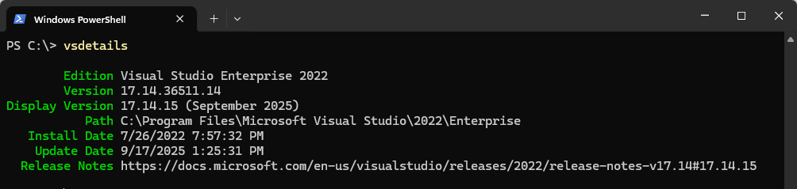

# About

This dotnet tool demonstrates how to use the [vswhere tool](https://github.com/Microsoft/vswhere) to locate Visual Studio installations on a machine and retrieve information about them.

Of course a developer can get the same information from Visual Studio about dialog while the purpose here is to get into the code and see how it works.

- `Install.bat` to install the dotnet tool
- `Uninstall.bat` to uninstall the dotnet tool