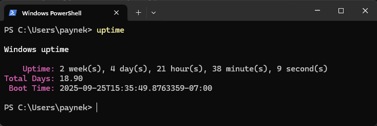

# About

Get Windows Uptime.

## dotnet tool

- Use `install.bat` to install the tool.
- Use `uninstall.bat` to uninstall the tool.

### Tool alias

Is define as `uptime` in the project file.

## Misc

- `IsoNoMsDateTimeConverter` usage in Program.Old
- `Serilog` is for debugging purpose only